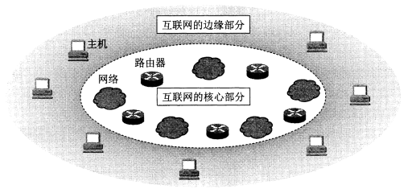
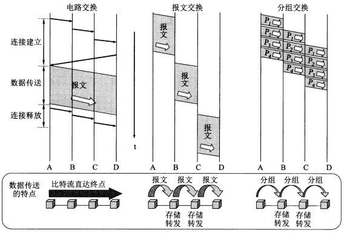
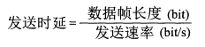
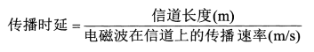
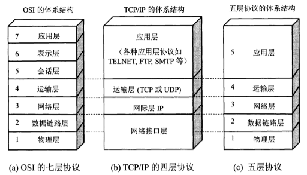
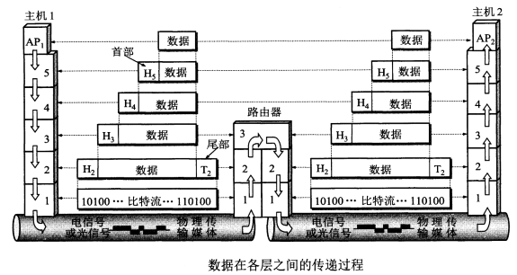
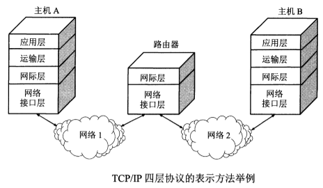
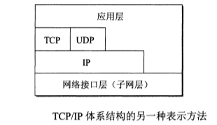
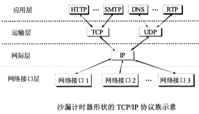

# 概述

* [1.1 互联网概述](#1.1-互联网概述)
* [1.2 互连网的组成](#1.2-互连网的组成)
  * [1.2.1 互联网的边缘部分](#1.2.1-互联网的边缘部分)
  * [1.2.2 互联网的核心部分](#1.2.2-互联网的核心部分)
    * [1. 电路交换](#1-电路交换)
    * [2. 分组交换](#2-分组交换)
* [1.3 计算机网络的性能指标](#1.3-计算机网络的性能指标)
    * [1.3.1 速率](#1.3.1-速率)
    * [1.3.2 带宽](#1.3.2-带宽)
    * [1.3.3 吞吐量](#1.3.3-吞吐量)
    * [1.3.4 时延](#1.3.4-时延)
      * [1. 发送时延](#1-发送时延)
      * [2. 传播时延](#2-传播时延)
      * [3. 处理时延](#3-处理时延)
      * [4. 排队时延](#4-排队时延)
* [1.4 计算机网络体系结构](#1.4-计算机网络体系结构)
    * [1.4.1 具有五层协议的体系结构](#1.4.1-具有五层协议的体系结构)
    * [1.4.2 TCP/IP的体系结构](#1.4.2-TCP/IP的体系结构)

## 1.1 互联网概述

**计算机网络**由若个**结点**和连接这些结点的**链路**组成。网络中的结点可以是计算机、集线器或路由器等。

网络把许多计算机连接在一起，而互连网则把许多网络通过路由器连接在一起。与网络相连的计算机常称为主机。

## 1.2 互连网的组成

互联网的拓扑结构，从工作方式上看，可以划分为两大块：

(1) **边缘部分** 由所有连接在互联网上的主机组成。这部分是用户直接使用的，用来进行通信（传送数据、音频或视频）和资源共享。

(2) **核心部分** 由大量网络和连接这些网络的路由器组成。这部分是为边缘部分提供服务的（提供连通性和交换）。

  
 

### 1.2.1 互联网的边缘部分

**计算机之间通信**是指：主机A的某个进程和主机B上的另一个进程进行通信。

在网络边缘的端系统之间的通信方式有两大类：客户-服务器方式（C/S方式）和对等方式（P2P方式）。

### 1.2.2 互联网的核心部分

和网络核心起特殊作用的是**路由器**，它是一种专用计算机。路由器实现**分组交换**，任务是**转发收到的分组**。

#### 1. 电路交换

两个用户通信前建立一条专用的物理通路。经过“建立连接（占用通信资源）->通话（一直占用通信资源）->释放资源（归还通信资源）”三个步骤。在通话的全部时间内，通话的两个用户始终占用端到端的通信资源。

线路的传输效率往往很低。但是连续传送大量数据时传输速率很快。

#### 2. 分组交换

分组交换采用存储转发技术。把一个**报文**划分成更小等长的**分组**后再进行传送。分组首部会加上目的地址、源地址等控制信息。分组又称“**包**”，分组首部也称为“**包头**”。

分组交换再传送数据前不必占用一条端到端的链路的通信资源。分组在哪段链路上传送才占用这段链路的通信资源。分组到达一个路由器后，先暂时存储下来（内存），查找转发表，再从一条合适的链路转发出去。分组在传输时一段一段地断续占用通信资源，省去建立连接和释放连接的开销，数据传输效率更高。

电报通信才采用过基于存储转发原理的**报文交换**。

**电路交换**——整个报文的比特流连续地从源点直达终点，好像在一个管道中传送。

**报文交换**——整个报文先传送到相邻结点，全部存储下来后查找转发表，转发到下一个结点。

**分组交换**——单个分组（报文的一部分）传送到相邻结点，存储下来后查找转发表，转发到下一个结点。

  
 

## 1.3 计算机网络的性能指标

七个性能指标。

### 1.3.1 速率

**速率**指数据的传输速率，也称**数据率**或**比特率**，单位是bit/s。

### 1.3.2 带宽

两种意义：原指信号具有的频带宽度，单位是赫（Hz）；还表示网络中某通道传输数据的能力，在单位时间内网络中的某信道所能通过的“最高数据率”，单位是bit/s。

### 1.3.3 吞吐量

表示在单位时间内通过某个网络的实际的数据量。

### 1.3.4 时延

指数据（报文、分组或比特）从网络的一端传到另一端所需的时间。

> 总时延 = 发送时延 + 传播时延 + 处理时延 + 排队时延

#### 1. 发送时延

是主机或路由器发送数据帧所需要的时间。

  
 

#### 2. 传播时延

是电磁波在信道中传播一定的距离需要花费的时间。

  
 

#### 3. 处理时延

是主机或路由器在收到分组时要花费一定的时间进行处理，例如分析分组的首部、从分组中提取数据部分、进行差错检验或者查找适当的路由等。

#### 4. 排队时延

是分组在经过网络传输时，要经过许多路由器。分组在进入路由器后要先在输入队列中排队等待处理。

### 1.3.5 时延带宽积

> 时延带宽积 = 传播时延 × 带宽

表示链路中可容纳的比特数。

### 1.3.6 往返时间RTT

### 1.3.7 利用率

信道利用率是某信道有百分之几的时间是被利用的（有数据通过）；网络利用率是全网络的信道利用率的加权平均值。

## 1.4 计算机网络体系结构

  
 

### 1.4.1 具有五层协议的体系结构

**应用层**：通过应用进程间的交互来完成特定网络应用。交互的数据单元为**报文**。

**运输层**：向**两台主机中进程之间的通信**提供通用的数据传输服务。

* 传输控制协议TCP——提供面向连接的、可靠的数据传输服务，数据传输单位是**报文段**。
* 用户数据报协议UDP——提供无连接的、尽最大努力的数据传输服务，数据传输单位是**用户数据报**。

**网络层**：为分组交换网上的不同**主机**提供通信服务。发送数据时网络层把传输层产生的报文段或用户数据包封装成**分组**或**包**进行传送，分组也叫**IP数据报**，或简称为**数据报**。

**数据链路层**：将网络层交下来的IP数据包组装成**帧**，在两个相邻结点之间的链路上传送帧。

**物理层**：传送的数据单位是**比特**。

  
 

### 1.4.2 TCP/IP的体系结构

  
 

  
 

  
 