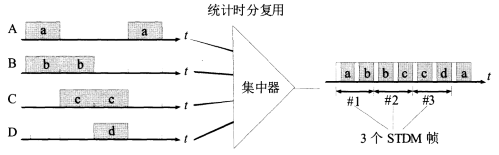

# 物理层

* [2.1 数据通信](#2.1)
  * [2.1.1 通信方式](#2.1.1)
  * [2.1.2 基带调制/编码](#2.1.2)
  * [2.1.3 带通调制](#2.1.3)
  * [2.1.4 信道的极限容量](#2.1.4)
* [2.2 物理层下面的传输媒体](#2.2)
* [2.3 信道复用技术](#2.3)
  * [2.3.1 频分复用](#2.3.1)
  * [2.3.2 时分复用](#2.3.2)
  * [2.3.3 统计时分复用](#2.3.3)
  * [2.3.4 波分复用](#2.3.4)
  * [2.3.5 码分复用](#2.3.5)
* [2.4 宽带接入技术](#2.4)
  
<h2 id="2.1">2.1 数据通信</h2>

<h3 id="2.1.1">2.1.1 通信方式</h3>

(1) **单向通信**，也称**单工通信**，即只能有一个方向的通信而没有方向的交互。

(2) **双向交替通信**，也称**半双工通信**，即通信的双方都可以发送消息，但不能同时发送（或同时接受）。

(3) **双向同时通信**，也称**全双工通信**，即通信的双方可以同时发送和接受信息。

<h3 id="2.1.2">2.1.2 基带调制/编码</h3>

数字信号常用的编码方式：

(1) **不归零制**：正电平代表1，负电平代表0。

(2) **归零制**：正脉冲代表1，负脉冲代表0。

(3) **曼彻斯特编码**：位周期中心的向上跳变代表0，位周期中心的向下跳变代表1。

(4) **差分曼彻斯特编码**：在每一位的中心处始终有跳变。位开始边界有跳变代表0，位开始边界没有跳变代表1。

  

<h3 id="2.1.3">2.1.3 带通调制</h3>

(1) **调幅(AM)**：即载波的振幅随基带数字信号而变化。例如，0或1分别对应于无载波或有载波输出。

(2) **调频(FM)**：即载波的频率随基带数字信号而变化。例如，0或1分别对应于频率f1和f2。

(3) **调相(PM)**：即载波的初始相位随基带数字信号而变化。例如，0或1分别对应于相位0度或180度。

  

<h3 id="2.1.4">2.1.4 信道的极限容量</h3>

(1) **信道能够通过的频率范围**

信道能够通过的频率范围是有限的。在任何信道中，码元传输的速率是有上限的，传输速率超过此上线就会出现码间串扰问题（信号中的高频分量在传输时会收到衰减，接收端接受的信号波形失去了码元之间的清晰界限），使得接收端对码元的判决成为不可能。

(2) **信噪比**

噪声会使接收端对码元的判决产生错误。

  

香农公式指出：**信号的极限信号传输速率**C是：

  

式中W为信道的带宽（Hz），S为信道内所传信号的平均功率，N为信道内部的高斯噪声功率。

香农公式表明：**信道的带宽或信道中的传输比越大，信息的极限传输速率就越高**。

对于频带带宽确定的信道，如果信噪比也不能提高，那么可以通过编码方法**让每一个码元携带更多比特的信息量**，也可以提高信息的传输速率。

<h2 id="2.2">2.2 物理层下面的传输媒体</h2>

**导引型传输媒体**：电磁波被导引沿着固体媒体（铜线或光纤）传播。

1. 双绞线
2. 同轴电缆
3. 光缆

**非导引型传输媒体**：传输媒体是自由空间，在非导引型传输媒体中电磁波的传输常称为无线传输。

<h2 id="2.3">2.3 信道复用技术</h2>

<h3 id="2.3.1">2.3.1 频分复用</h3>

频分复用的所有用户在同样的时间占用不同的带宽资源。

  

<h3 id="2.3.2">2.3.2 时分复用</h3>

时分复用的所有用户在不同的时间占用同样的频带宽度。

  

<h3 id="2.3.3">2.3.3 统计时分复用</h3>

是一种改进的时分复用，使用集中器把低速用户的数据集中起来，再通过高速线路发送。

  

<h3 id="2.3.4">2.3.4 波分复用</h3>

光的频分复用。由于光载波的频率很高，因此习惯上用波长而不是频率来表示所使用的光载波。

<h3 id="2.3.5">2.3.5 码分复用</h3>

**码分多址CDMA**

每一个站被指派一个唯一的m bit码分序列。如果一个站要发送比特1，则发送它自己的m bit码片序列；如果发送比特0，则发送该码片序列的二进制反码。

假设S站的8 bit码片序列是00011011。当S发送比特1时，它就发送序列00011011；当S发送比特0时，它就发送11100100。可以将码片序列中的0写成-1，将1写成+1。因此，S站的码片序列可以写做(-1-1-1+1+1-1+1+1)。

两个不同站的码片序列是正交的。即，对于任意两个码片，用向量 *S* 和向量 *T* 表示，有：

  

**一个站的码片序列的向量与其它各站码片序列的向量的内积为0；任何一个码片向量和该码片向量自己的规格化内积为1，任何一个码片向量和该码片反码的向量的规格化内积为-1。**

假设X站要接受S站发送的数据，需要知道S站特有的码片序列。X站使用它得到的码片向量 *S* 与接收到的未知信号进行求内积的运算。X站接收到的信号是各站发送的码片序列之和。根据叠加原理，其它所有站的信息都被过滤（内积为0），只剩下S站发送的信号。当S站发送比特1，计算的内积为+1，发送比特0，内积为-1。

  

<h2 id="2.4">2.4 宽带接入技术</h2>

1. **非对称数字用户线 ADSL**：用数字技术对现有的模拟电话用户线进行改造。
2. **光纤同轴混合网 HFC**：在有线电视网的基础上开发的。
3. **FTTx**：即光纤到......
