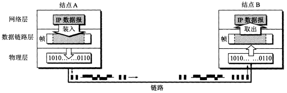
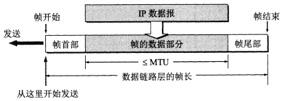
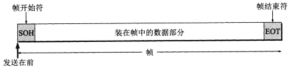
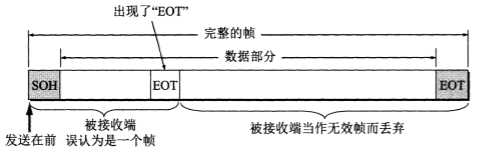
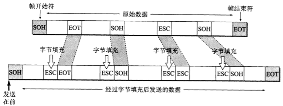
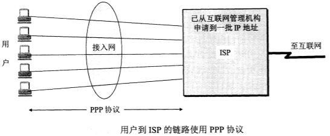
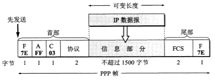
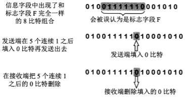

# 数据链路层

数据链路层使用的信道主要有两种：
1. **点对点信道**。一对一的点对点通信方式。
2. **广播信道**。一对多的广播通信方式。

<h2>3.1 使用点对点信道的数据链路层</h2>

<h3>3.1.1 点对点通信步骤</h3>

1. 结点 A 的数据链路层把网络层交下来的 IP 数据报添加首部和尾部封装成帧。
2. 结点 A 把封装好的帧发送给结点 B 的数据链路层。
3. 若结点 B 的数据链路层接收到的帧无差错，则从收到的帧中提取 IP 数据报交给上面的网络层，否则丢弃这个帧。

 

<h3>3.1.2 三个基本问题</h3>

<h4>1. 封装成帧</h4>

将网络层交下来的 IP 数据报添加首部和尾部。使用控制字符 SOH（16进制编码是01）和 EOT（16进制编码是04）表示帧的首部开始和尾部结束。

 

 

<h4>2. 透明传输</h4>

**透明**表示某一个实际存在的事物看起来却好像不存在一样。

如果帧的数据中的某个字节的二进制恰好和 SOH 或 EOT 这种控制字符一样，那么数据链路层会错误地“找到帧的边界”，把剩下的那部分数据丢弃。

 

解决方案：发送端的数据链路层在数据中出现控制字符 SOH 或 EOT 的前面插入一个转义字符 ESC（16进制编码为1B），而在接收端的数据链路层把数据送往网络层之前删除这个插入的转义字符。这种方法叫做**字节填充**或**字符填充**。如果转义字符也出现在数据当中，那么在转义字符前面再插入一个转义字符，接收端收到两个转义字符时删除其中前面的一个。

 

<h4>3. 差错检验</h4>

目前数据链路层广泛使用了**循环冗余检验**（CRC）来检查**比特差错**。

发送端把数据划分成帧，假定每帧 k 个比特。CRC 运算在帧后面添加供差错检测的n位冗余码，一共发送 (k+n) 位。

冗余码的计算方法：假设待传送帧为 M。2^n 乘 M 作为被除数（相当于在 M 后面添加 n 个0），使用双方事先商定的长度为 (n+1) 位的数 P 作为除数，用二进制的模2运算（加法不进位，减法按加法规则计算，例如1111+1010=0101）得:

> 2^n • M / P = Q …… R

上式中 Q 为上，余数为 R。这个余数 R 就作为冗余码（也叫帧检验序列 FCS）拼接在帧 M 后发送出去。因此发送得帧是2^n • M + FCS。当接收端接收到帧进行 CRC 检验后得到余数为0，就判定这个帧没有差错，否则判定帧有差错。没有确保可靠传输。

<h2>3.2 点对点协议PPP</h2>

互联网用户通常需要连接到某个 ISP（互联网服务提供商）之后才能接入到互联网，PPP 协议是用户计算机和 ISP 进行通信时所使用的数据链路层协议。

 

<h3>3.2.1 PPP协议帧格式</h3>

<h4>1. PPP帧格式</h4>

 

<h4>2. 字节填充</h4>

将 0x7D 作为转义字符。

1. 信息中出现的每一个 0x7E 字节转换成2字节序列 (0x7D, 0x5E)。
2. 信息中出现的每一个 0x7D 字节(和转义字符相同)转换成2字节序列 (0x7D, 0x5D)。
3. 信息中出现ASCII码控制字符，则在该字符前面加一个 0x7D。

<h4>3. 零比特填充</h4>

再发送端，每连续的5个1后面填入一个0。接收端再删除填入的0。

 

<h2>3.3 使用广播信道的数据链路层</h2>