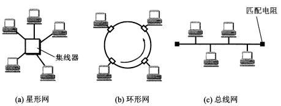
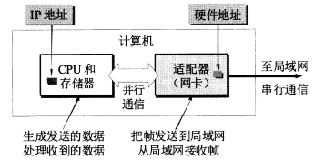
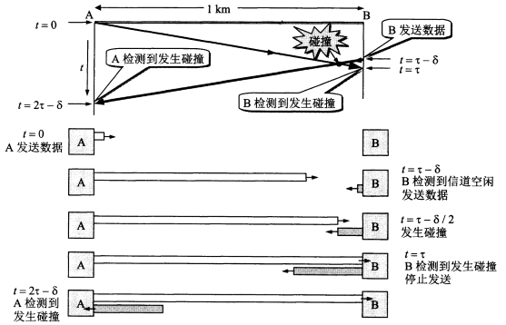
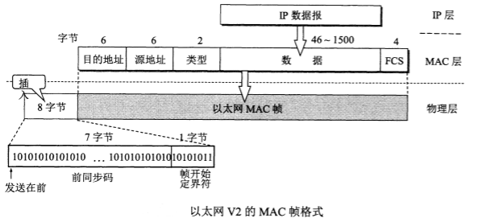

# 数据链路层

数据链路层使用的信道主要有两种：
1. **点对点信道**。一对一的点对点通信方式。
2. **广播信道**。一对多的广播通信方式。

* [3.1 使用点对点信道的数据链路层](#3.1)
  * [3.1.1 点对点通信步骤](#3.1.1)
  * [3.1.2 三个基本问题](#3.1.2)
    * [1. 封装成帧](#3.1.2.1)
    * [2. 透明传输](#3.1.2.2)
    * [3. 差错检验](#3.1.2.3)
* [3.2 点对点协议 PPP](#3.2)
  * [3.2.1 PPP协议帧格式](#3.2.1)
    * [1. PPP帧格式](#3.2.1.1)
    * [2. 字节填充](#3.2.1.2)
    * [3. 零比特填充](#3.2.1.3)
* [3.3 使用广播信道的数据链路层](#3.3)
  * [3.3.1 局域网](#3.3.1)
  * [3.3.2 CSMA/CD 协议](#3.3.2)
  * [3.3.3 使用集线器的星型拓扑](#3.3.3)
  * [3.3.4 以太网的信道利用率](#3.3.4)
  * [3.3.5 以太网的 MAC 层](#3.3.5)
    * [1. 硬件地址](#3.3.5.1)
    * [2. MAC 帧的格式](#3.3.5.2)

<h2 id="3.1">3.1 使用点对点信道的数据链路层</h2>

<h3 id="3.1.1">3.1.1 点对点通信步骤</h3>

1. 结点 A 的数据链路层把网络层交下来的 IP 数据报添加首部和尾部封装成帧。
2. 结点 A 把封装好的帧发送给结点 B 的数据链路层。
3. 若结点 B 的数据链路层接收到的帧无差错，则从收到的帧中提取 IP 数据报交给上面的网络层，否则丢弃这个帧。

 

<h3 id="3.1.2">3.1.2 三个基本问题</h3>

<h4 id="3.1.2.1">1. 封装成帧</h4>

将网络层交下来的 IP 数据报添加首部和尾部。使用控制字符 SOH（16进制编码是01）和 EOT（16进制编码是04）表示帧的首部开始和尾部结束。

 

 

<h4 id="3.1.2.2">2. 透明传输</h4>

**透明**表示某一个实际存在的事物看起来却好像不存在一样。

如果帧的数据中的某个字节的二进制恰好和 SOH 或 EOT 这种控制字符一样，那么数据链路层会错误地“找到帧的边界”，把剩下的那部分数据丢弃。

 

解决方案：发送端的数据链路层在数据中出现控制字符 SOH 或 EOT 的前面插入一个转义字符 ESC（16进制编码为1B），而在接收端的数据链路层把数据送往网络层之前删除这个插入的转义字符。这种方法叫做**字节填充**或**字符填充**。如果转义字符也出现在数据当中，那么在转义字符前面再插入一个转义字符，接收端收到两个转义字符时删除其中前面的一个。

 

<h4 id="3.1.2.3">3. 差错检验</h4>

目前数据链路层广泛使用了**循环冗余检验**（CRC）来检查**比特差错**。

发送端把数据划分成帧，假定每帧 k 个比特。CRC 运算在帧后面添加供差错检测的n位冗余码，一共发送 (k+n) 位。

冗余码的计算方法：假设待传送帧为 M。2^n 乘 M 作为被除数（相当于在 M 后面添加 n 个0），使用双方事先商定的长度为 (n+1) 位的数 P 作为除数，用二进制的模2运算（加法不进位，减法按加法规则计算，例如1111+1010=0101）得:

> 2^n • M / P = Q …… R

上式中 Q 为上，余数为 R。这个余数 R 就作为冗余码（也叫帧检验序列 FCS）拼接在帧 M 后发送出去。因此发送得帧是2^n • M + FCS。当接收端接收到帧进行 CRC 检验后得到余数为0，就判定这个帧没有差错，否则判定帧有差错。没有确保可靠传输。

<h2 id="3.2">3.2 点对点协议 PPP</h2>

互联网用户通常需要连接到某个 ISP（互联网服务提供商）之后才能接入到互联网，PPP 协议是用户计算机和 ISP 进行通信时所使用的数据链路层协议。

 

<h3 id="3.2.1">3.2.1 PPP协议帧格式</h3>

<h4 id="3.2.1.1">1. PPP帧格式</h4>

 

<h4 id="3.2.1.2">2. 字节填充</h4>

当信息字段中出现和标志字段一样的比特（0x7E）时，就必须采取一些措施使这种形式上和标志字段一样的比特组合不出现在信息字段中。当 PPP 使用异步传输时，将 0x7D 作为转义字符，并使用字节填充。

1. 信息中出现的每一个 0x7E 字节转换成2字节序列 (0x7D, 0x5E)。
2. 信息中出现的每一个 0x7D 字节(和转义字符相同)转换成2字节序列 (0x7D, 0x5D)。
3. 信息中出现ASCII码控制字符，则在该字符前面加一个 0x7D。

<h4 id="3.2.1.3">3. 零比特填充</h4>

PPP 协议用在 SONET/SDH 链路时，使用同步传输，PPP 协议采用零比特填充方法来实现透明传输。在发送端，每连续的5个1后面填入一个0。接收端再删除填入的0。

 

<h2 id="3.3">3.3 使用广播信道的数据链路层</h2>

<h3 id="3.3.1">3.3.1 局域网</h3>
局域网的主要特点：网络为一个单位所拥有，且地理范围和站点数目均有限。

可以按照网络拓扑结构对局域网进行分类：

 

计算机通过适配器和局域网进行通信：

 

<h3 id="3.3.2">3.3.2 CSMA/CD 协议</h3>

CSMA/CD指载波监听多点接入/碰撞检测。

1. **多点接入**：说明这是总线型网络，许多计算机以多点接入的方式连接到总线上。

2. **载波监听**：发送前和发送中，每个站都必须不停地检测信道。在发送前，如果监听到信道正在使用，就必须等待。

3. **碰撞检测**：边发送边监听，如果检测到自己在发送数据时其它站也在发送数据，就表示发生了碰撞。任何一个发送数据的站，一旦发现出现碰撞，就立即停止发送数据。

在使用CSMA/CD协议时，一个站不可能同时进行发送和接收，因此是进行双向交替通信（半双工通信）。

最先发送数据的站，在发送数据帧后至多经过时间 2τ 就可知道所发送的数据是否遭受碰撞。因此以太网端到端往返时间 2τ 称为 **争用期**。经过争用期这段时间还没有检测到碰撞，才能肯定这次发送不会发生碰撞。

当发生碰撞时，站点要停止发送，等待一段时间再重传。这个时间采用**截断二进制指数退避**算法来确定。从离散的整数集合 {0, 1, .., (2^k-1)} 中随机取出一个数，记作 r，其中 k=min[重传次数，10]。重传应推后的时间就是 r 倍的争用期。

 

<h3 id="3.3.3">3.3.3 使用集线器的星型拓扑</h3>

传统以太网最初使用粗同轴电缆，后来演进到使用比较便宜的细同轴电缆，最后发展为使用更便宜和更灵活的双绞线。这种以太网采用星型拓扑，在星型中心增加了集线器。

集线器的特点：
1. 集线器使用电子器件模拟实际电缆线的工作。使用集线器的以太网在逻辑上仍是一个总线网，各站共享逻辑上的总线，使用的还是 CSMA/CD 协议。网络中在同一时刻至多只允许一个站发送数据。
2. 一个集线器有许多接口，很像一个多接口的转发器。
3. 集线器工作在物理层，每个接口简单地转发比特，不进行碰撞检测。
4. 集线器采用专门的芯片，进行自适应串音回波抵消，这样可使接口转发出去的较强信号不致对该接口接收到的较弱信号产生干扰。

<h3 id="3.3.4">3.3.4 以太网的信道利用率</h3>

假设发送帧所需的时间是 $T_0$，等于帧长除以发送速率。那么，成功发送一个帧需要占用信道的时间是 $T_0 + τ $。必须经过时间 $T_0 + τ $ 后以太网的媒体才能完全进入空闲状态，才能允许其他站发送数据。因此，要提高以太网的信道利用率，就必须减小 $τ$ 与 $T_0$ 之比。

<h3 id="3.3.5">3.3.5 以太网的 MAC 层</h3>

<h4 id="3.3.5.1">1. 硬件地址</h4>

又称为**物理地址**或**MAC地址**。IEEE 802 标准为局域网规定了一种48位全球地址，是指局域网上的每一台计算机中**固化在适配器的 ROM 中的地址**。

<h4 id="3.3.5.2">2. MAC 帧的格式</h4>

 

类型字段标志上一层使用的什么协议，以便把收到的 MAC 帧的数据上交给上一层的这个协议。最后一个字段是帧检验序列 FCS，使用 CRC 检验。