# 网络层

* [4.1 网络层提供的两种服务](#4.1)
* [4.2 中间设备](#4.2)
* [4.3 网际协议 IP](#4.3)
  * [4.3.1 分类的 IP 地址](#4.3.1)
    * [1. IP 地址及其表示方法](#4.3.1.1)
    * [2. 常用的三种类别的 IP 地址](#4.3.1.2)
  * [4.3.2 IP 地址与硬件地址](#4.3.2)
  * [4.3.3 地址解析协议 ARP](#4.3.3)
  * [4.3.4 IP 数据报的格式](#4.3.4)
  * [4.3.5 IP 层转发分组的流程](#4.3.5)

<h2 id="4.1">4.1 网络层提供的两种服务</h2>

1. 虚电路服务，通信时先建立连接，以预留双方通信所需的一切网络资源。
2. 数据报服务，网络层向上只提供简单灵活的、无连接的、尽最大努力交付的数据报服务。网络在发送分组时不需先建立连接。每一个分组 (IP 数据包) 独立发送，与前后的分组无关 (不进行编号)。网络层不提供服务质量的承诺。也就是说，所传送的分组可能出错、丢失、重复和失序 (不按序到达终点)，当然也不保证分组交付的时限。

 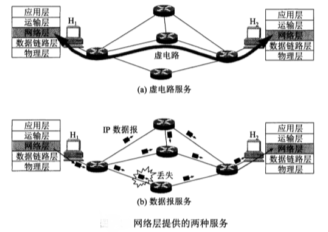

 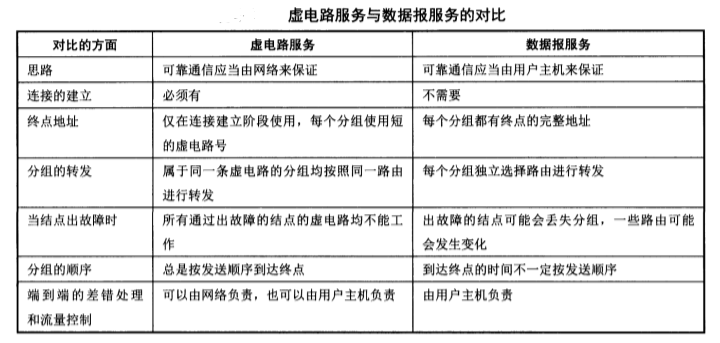

<h2 id="4.2">4.2 中间设备</h2>
将网络互相连接起来要使用一些中间设备。根据中间设备所在层次，有以下四种不同的中间设备：

1. 转发器 -> 物理层

2. 网桥或桥接器 -> 数据链路层

3. 路由器 -> 网络层

4. 网关 -> 网络层以上

<h2 id="4.3">4.3 网际协议 IP</h2>

<h3 id="4.3.1">4.3.1 分类的 IP 地址</h3>

<h4 id="4.3.1.1">1. IP 地址及其表示方法</h4>

IP 地址 ::= { <网络号>, <主机号> }

 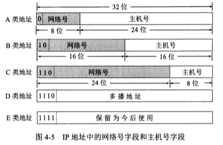

<h4 id="4.3.1.2">2. 常用的三种类别的 IP 地址</h4>

 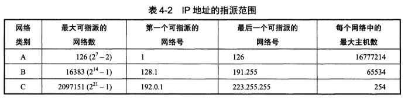

 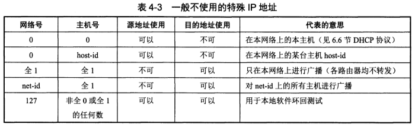

<h3 id="4.3.2">4.3.2 IP 地址与硬件地址</h3>

物理地址是数据链路层和物理层使用的地址；IP 地址是网络层和以上各层使用的地址，是一种逻辑地址。

 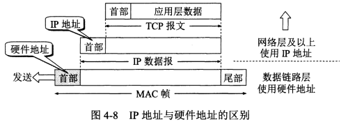

下图表示主机 H1 与 主机 H2 通信，HA 为硬件地址。值得注意的是，MAC 帧在不同的网络上传送时，其 MAC 帧首部中的源硬件地址和目的硬件地址要发生变化。

 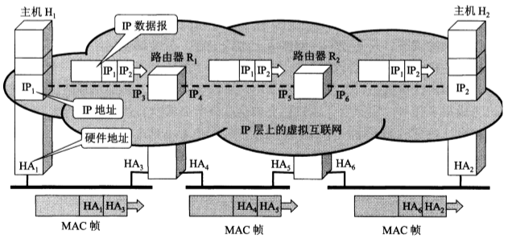

<h3 id="4.3.3">4.3.3 地址解析协议 ARP</h3>

ARP 协议通常划归到网络层，用途是实现由 IP 地址得到硬件地址。

每个主机都有一个 ARP 高速缓存，里面有本局域网上的各主机和路由器的 IP 地址到硬件地址的映射表。

如果主机 A 知道主机 B 的 IP 地址，但是 ARP 高速缓存中没有该 IP 地址到硬件地址的映射，此时主机 A 通过广播的方式发送 ARP 请求分组，主机 B 收到该请求后会发送 ARP 响应分组给主机 A 告知其硬件地址，主机 A 和 主机 B 都会向其高速缓存中写入对方主机 IP 地址到硬件地址的映射。

ARP 对保存在高速缓存中的每一个映射地址项目都设置生存时间，凡超过生存时间的项目会从高速缓存中删除。这样可以解决网络中某终端硬件地址改变（比如因网络适配器损坏而更换）的问题。

 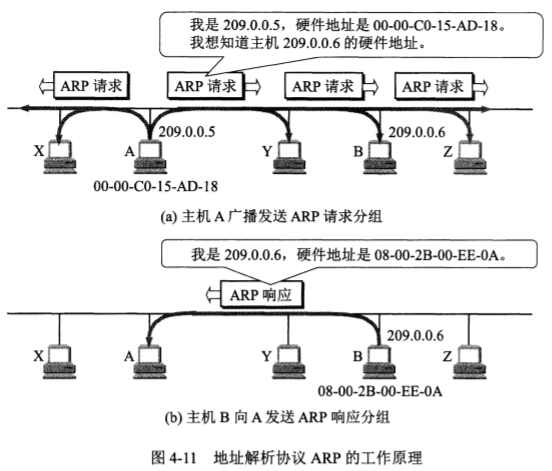

<h3 id="4.3.4">4.3.4 IP 数据报的格式</h3>

 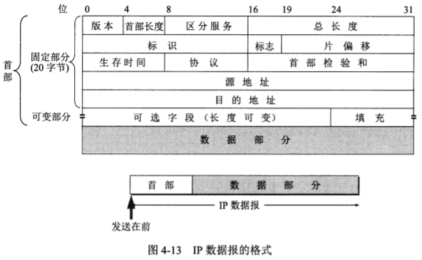

**版本**：占4位，有 4 (IPv4) 和 6 (IPv6) 两个值。

**首部长度**：占 4 位，因此最大值为 15 (1111)。值为 1 表示 1 个 32 位字的长度，也就是 4 字节。IP 首部的固定长度是 20 字节，因此该值最小为 5 (0101) 。当首部长度为最大值 15 时，表明首部长度达到 15 个 32 位字长，即 60 字节。当 IP 分组的首部长度不是 4 字节的整数倍时，就必须利用最后的填充字段来填充。因此 IP 数据报的数据部分永远在 4 字节的整数倍时开始。

**区分服务**：占 8 位，用来获得更好的服务，一般情况下不使用。

**总长度**：首部和数据之和的长度，单位是字节。IP 协议规定，在互联网中所有主机和路由器，必须能够接受长度不超过 576 (数据长度512 + 最长IP首部60 + 富余量4) 字节的数据报。

**标识**：占 16 位，在数据报长度过长从而发生分片的情况下，相同数据报的不同分片具有相同的标识符，使得分片后的各数据报片最后能正确地重装成原来的数据报。

**标志**：占 3 位，MF = 1 表示后面还有分片，DF = 0 表示允许分片。

**片偏移**：占 13 位。片偏移指出：较长的分组在分片后，某片在原分组中的相对位置。片偏移以 8 个字节为偏移单位。

例：数据报总长度为 3820 字节，其数据部分为 3800 字节，需要分片为长度不超过1420字节的数据报片。因为固定首部长度为 20 字节，因此每个数据报片的数据部分长度不超过 1400 字节。于是分为三个数据报片，分别为 1400，1400，1000字节。

 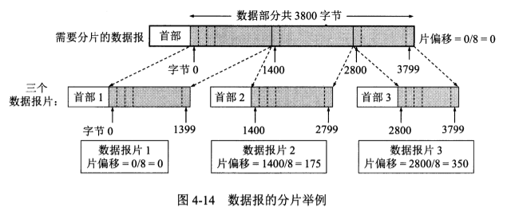

**生存时间**：占 8 位，TTL，表明数据报在网络中的寿命。其目的是防止无法交付的数据报无限制地在互联网中兜圈子。每经过一个路由器，TTL 减去数据报在路由器所消耗地一段时间。当 TTL 值减为 0 时，就丢弃这个数据报。

**协议**：占 8 位，指出此数据报所携带的数据所使用的是何种协议，使目的主机的 IP 层知道应将数据部分上交给哪个协议进行处理。

**首部检验和**：占 16 位。只检验数据报的首部，不包括数据部分。检验方法：发送方把 IP 数据报首部划分为许多 16 位字的序列，并把检验和字段置 0。用反码算术运算把所有 16 位字相加后，将得到的和的反码写入检验和字段。接收方收到数据报后，将首部的所有 16 位字再使用反码算术运算相加一次。将得到的和取反码，即得出接收方检验和的计算结果。若首部未发生变化，则结果为 0，保留该数据报。否则认为出错，丢弃该数据报。

> 反码算术运算：两个数进行二进制反码求和时，从低位到高位逐位进行计算。0 和 0 相加是 0，0 和 1 相加是 1， 1 和 1 相加是 0 但要产生一个进位 1，加到下一列。若最高为相加后产生进位，则最后得到的结果要加 1。

 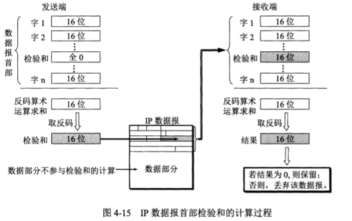

**源地址**：占 32 位。

**目的地址**：占 32 位。

<h3 id="4.3.5">4.3.5 IP 层转发分组的流程</h3>

在路由表中，对每一条路由最主要的是以下两个信息：
> (目的网络地址， 下一跳地址)

在 IP 数据报的首部写上的 IP 地址是源 IP 地址和目的 IP 地址，而没有中间经过的路由器的 IP 地址。既然 IP 数据报中没有下一跳路由器的 IP 地址，那么待转发的数据报是怎样找到下一跳路由器的？
> 当路由器收到一个待转发的数据报，在从路由表得出下一跳路由器的 IP 地址后，送交数据链路层的网络接口软件。网络接口软件负责把下一跳路由器的 IP 地址转换成硬件地址（使用 ARP），并将此硬件地址放在链路层的 MAC 帧的首部。

路由器**分组转发算法**如下：
1. 从数据报的首部提取目的主机的 IP 地址 D，得出目的网络地址为 N。
2. 若 N 是与此路由器直接相连的某个网络地址，则进行直接交付，不需再经过其它的路由器，直接把数据报交付目的主机（这里包括把目的主机地址 D 转换为具体的硬件地址，把数据报封装为 MAC 帧，再发送此帧）；否则就是间接交付，执行 3。
3. 若路由表中有目的地址为 D 的特定主机路由，则把数据报传送给路由表中所指明的下一跳路由器；否则，执行 4。
4. 若路由表中有到达网络 N 的路由，则把数据报传送给路由表中所指明的下一跳路由器；否则，执行 5。
5. 若路由表中有一个默认路由，则把数据报传送给路由表中所指明的默认路由器；否则，执行 6。
6. 报告转发分组出错。

 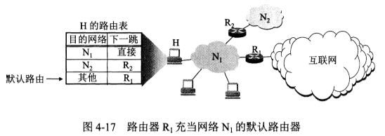
